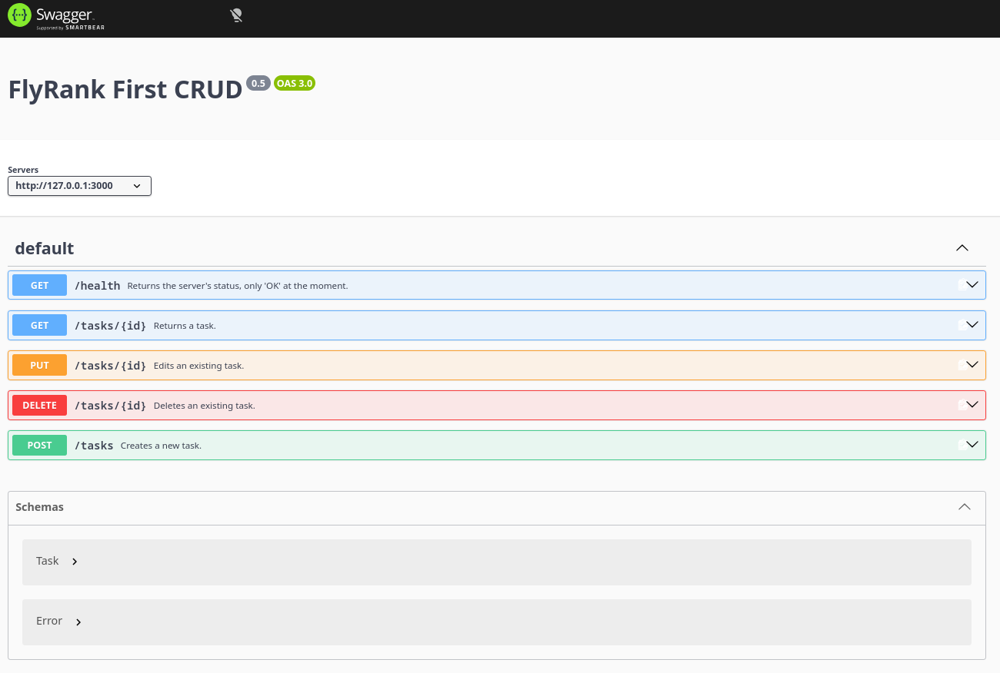

# FlyRank First CRUD

## By Astor Aricó

Made for the [FlyRank AI Internship's](https://internship.flyrank.ai) Backend AI Engineering track.

This is a CRUD API, which can **c**reate, **r**ead, **u**pdate, and **d**elete tasks, in JSON format. The tasks are saved in memory, so, every time it starts, the list of tasks will reset. Tasks have these properties: **id**, a unique identifier (an integer), **title**, the task's name (a string), and **done**, whether it's done or not (a boolean).

## Setup

- First, download this repository's contents, and unzip the files at some directory.
- **Node.js** support is required. You can download it from [its official webpage.](https://nodejs.org/download)
- Node.js comes with **npm**. To install the required dependencies, open your command line of choice at the directory where you unzipped the files, and run this command: `npm install` (with no parameters). That will install all required dependencies at once.
- To run the API, run this command: `npm start`. You can now interact with the API.

## Using the API

Once you run it, the API is hosted within your computer at <http://127.0.0.1:3000> (or <http://localhost:3000>, which is the same thing).

The endpoints are as follows:
- GET `/health`, which returns the API's status.
- GET `/tasks/:id`, which returns a task, that is, a small JSON, proven the entered ID is valid. By default, the existing tasks are "1", "2", and "3".
- POST `/tasks`, where new tasks can be added. You have to enter only the title, the API will do the rest. It will return the task you created.
- PUT `/tasks/:id`, where an existing task (whose ID matches the path parameter) can be edited. You cannot edit the ID, but you can edit everything else.
- DELETE `/tasks/:id`, where an existing task can be deleted.
- GET `/docs`, which serves Swagger UI (see below).

You can use **curl** or **Swagger UI** to interact with the API endpoints.

### curl

To interact with the API using **curl**, open a second command prompt, then run a command, as described below. The structure is as follows:

`curl -i -X (non-GET method goes here) http://127.0.0.1:3000/(endpoint) -H (Content-Type header if needed) -d (request body if needed)`

### Reading a task - GET `/tasks/:id`
Use this command: `curl -i http://127.0.0.1:3000/tasks/1` (you can replace the number with any valid task ID). If the entered ID does match to an existing task, a 200 status will be returned, alongside the task. Else, a 404 status will be returned.

### Creating a task - POST `/tasks`
Use this command: `curl -i -X POST http://127.0.0.1:3000/tasks -H "Content-Type: application/json" -d '{"title": "Task title goes here"}'`  
You don't need any property other than the title (and if you do add another property, it will get ignored).  
Important: The JSON you'll be sending in the request body, after `-d`, should be within these quotes: `''`,  and the `"title"` property has to be written exactly like that, with the `""` quotation marks; the same applies to the property's value. *Doing otherwise will break the JSON, and thus you'll get a 400 status.*  
If successful, it will return a 201 status, with the created task. The ID is generated automatically from taking the highest extant ID and adding one, and the "done" boolean is false by default. Else, it returns a 400 status, and the response body gives a brief description of what's wrong.

### Editing (updating) a task -  PUT `/tasks/:id`
Use this command: `curl -i -X PUT http://127.0.0.1:3000/tasks/2 -H "Content-Type: application/json" -d '{"title": "Task title goes here", "done": true (or false)}'`.  
You can enter the `title` property alone, same goes for the `done` property, but at least one of them have to be present in the request body, else, you'll get a 400 response. If you entered valid values, you'll get a 200 response, with the edited task. If the values are invalid, or absent, you'll get a 400 response with a description of what's wrong.

### Deleting a task - DELETE `/tasks/:id`
Use this command: `curl -i -X DELETE http://127.0.0.1:3000/tasks/3`  
If successful, you'll get a 204 response with no content. If the ID you entered doesn't map to an existing task, you'll get a 404 response.

It's recommended to check the curl manual, with `man curl` (Unix and Linux) or `Get-Help curl` (Windows PowerShell).

### Swagger UI

To use Swagger UI, go to <http://127.0.0.1:3000/docs> on your browser. You should see this:

The UI itself has documentation on what each endpoint does, so, no need to explain further.